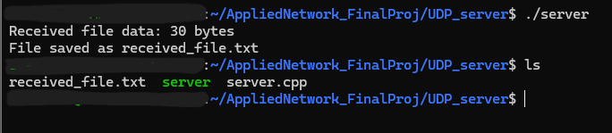

Portfolio
=========

Programming Projects
--------------------

*For access to my private project repositories, please [email me](mailto:ZDWeaver@csustudent.net?subject=GitHub%20Access) with the subject line, GitHub Access.

---
### [UDP Fileshare | CSCI 332](project1.md)

---
### [Online Supply Co - Store Simulation | CSCI 325](project2.md)

---
### [Single Cycle Processor | CSCI 330](project3.md)

---
### [Project 4 Title | CSCI 332](project1)

---

Ethics Papers
-------------

### [Ethics as it Relates to Copyright in Computer Science](pdf/CSCI 301 Ethics paper Copyright.pdf)

-   **Class: CSCI 301 - Survey of Scripting Languages**  
-   **Grade: A**

### [Handling Ethical Issues from a Biblical Perspective](pdf/CSCI 325 Ethics Paper.pdf)

-   **Class: CSCI 325 - Object Oriented Programming** 
-   **Grade: A**

### [Ethical Implications of Artificial Intelligence](pdf/CSCI210 - AI Ethics Paper.pdf)

-   **Class: CSCI 210 - Intro to Computer Science Through Robotics** 
-   **Grade: A**

---

Presentations
-------------

### [The Shadow Brokers](pdf/The Shadow Brokers.pdf)
### [STUXNET - The Worm That Prevented War](/pdf/STUXNET.pdf)

- **Class: Principles of Cybersecurity** 
- **Grade: B+**

---

Page template forked from <a href="https://github.com/csu-cs/csci-portfolio">CSU-CS</a>

<!-- Remove above link if you don't want to attributive -->
