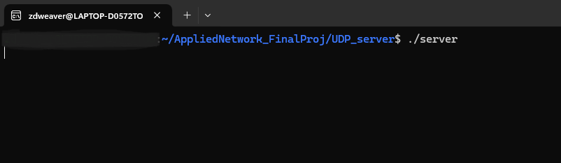
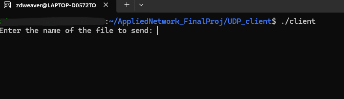
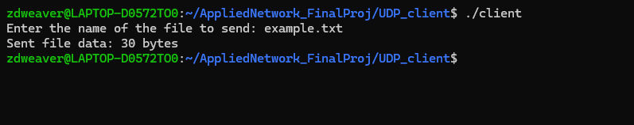

[Back to Portfolio](./)

Fileshare Server
===============

-   **Class: CSCI332 - Applied Networking** 
-   **Grade: B+** 
-   **Language(s): C++** 
-   **Source Code Repository:** [Click Here](https://github.com/zachWeav/CSCI332_Fileshare_Server) 
    (Please [email me](mailto:ZDWeaver@csustudent.net?subject=GitHub%20Access) to request access.)

## Project description

The UDP Fileshare project is a lightweight client-server application built using C++ and UDP protocol.  This project allows users to transfer text files from a client to a server over a network.
The project is designed to facilitate basic file-sharing capabilities and only supports plain text files (.txt).

**Features:**
-    **Client-Server Model:** The project allows the user to select a text file from the client directory to be sent and saved to a corresponding server directory.
-    **File Transfer via UDP:** The project uses the User Datagram Protocol for file transfer, implementing simplicity and efficiency for sending small text files.
-    **Dynamic File Size Handling:** The project dynamically adjusts to handle varying file sizes by sending the size information to the server before transmitting the actual file contents.
-    **File Storage:** The server receives the file and stores it as 'recieved_file.txt' in the server directory.  

## How to compile and run the program

**Prerequisites:** In order to successfully compile the files you will need a gcc compiler installed on your system.

**Step 1:** Open Two Terminal Windows/Tabs
to compile the separate client and server.

**Step 2:** Navigate to the 'UDP_server' directory where the source file is located and compile using g++
```bash
g++ server.cpp -o server
```
This generates the executable 'server'

**Step 3:** In the second terminal, navigate to the 'UDP_client' directory and compile the source file using g++
```bash
g++ client.cpp -o client
```
This generates the executable 'client'

**Step 4:** In the server terminal, run the server executable
NOTE: The server must be run first to receive files from the client
```bash
./server
```

**Step 5:** In the client terminal, run the client executable
NOTE: The client may now send files to the server
```bash
./client
``` 
## UI Design

After compiling and running the server client executables, the user will be asked to choose a file to send from the UDP_client directory to the UDP_server directory.  Successful file transfer will occur with server acknowlegement.

  
Fig 1. Running the server executable.

  
Fig 2. Running the client executable.

  
Fig 3. The user inputs a file for the client to send.

  
Fig 4. The server successfully receives the file.


[Back to Portfolio](./)
