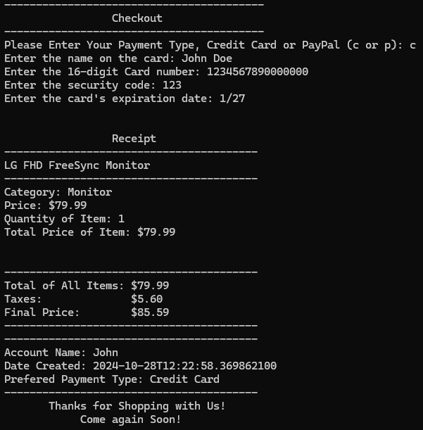

[Back to Portfolio](./)

Online Store Simulator
===============

-   **Class: CSCI325 - Object Oriented Programming** 
-   **Grade: A** 
-   **Language(s): Java** 
-   **Source Code Repository:** [Click Here](https://github.com/zachWeav/CSCI325_Online_Store_Simulator/tree/main) 
    (Please [email me](mailto:ZDWeaver@csustudent.net?subject=GitHub%20Access) to request access.)
    
## Project description

The Online Supply Co program is a Java-based application designed to emulate the core functionality of a real-world online store by walking users through a simple shopping process.  The project allows users to manage an account, browse items in the shop, add them to a cart, and complete a simulated checkout process.  

**Features:**
-    **User Account Management**
-    **Item Browsing and Selection**
-    **Interactive Shopping Cart**
-    **Checkout and Payment Simulation**

## How to compile and run the program

**Prerequisites:** Java Development Kit (JDK) is necessary to compile and run the Java code.

**Step 1:** Navigate to the project directory 'OnlineSupplyCo' 

**Step 2:** Compile all Java files required to run the project
```bash
javac src/CSU/CSCI325/*.java
```

**Step 3:** Run the Java program
```bash
java -cp src CSU.CSCI325.OnlineSupplyCo
```


## UI Design

After compiling and running the Java program, the user will be walked through an emulated online store.

  
Fig 1. The user is greeted with the login page

  
Fig 2. The user may sign in with an existing account or create a new one.  All account credentials are stored in a text file in the folders directory for future use.

  
Fig 3. Once logged in, users are greeted with three menu options.

  
Fig 4. On the products page, users may choose to add products to their cart.

  
Fig 4.1 After adding a product to their cart, users may choose to add more items or return to the main menu.

  
Fig 5 Users may view their cart at any time to see additional details before checking out.

  
Fig 6 If they choose to checkout, users are asked to choose their preferred form of payment and enter any required payment information.

  
Fig 7 After checking out, a receipt is displayed including the user's order and payment information.


[Back to Portfolio](./)
