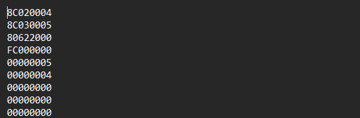
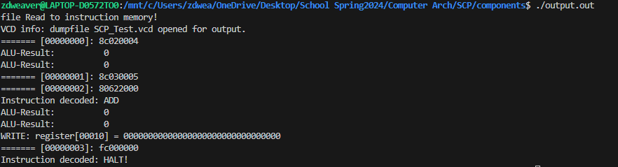

[Back to Portfolio](./)

Single Cycle Processor
===============

-   **Class: CSCI330 - Computer Architecture** 
-   **Grade: B** 
-   **Language(s): Verilog** 
-   **Source Code Repository:** [Click Here](https://github.com/zachWeav/CSCI330_Computer_Architecture/tree/main) 
    (Please [email me](mailto:ZDWeaver@csustudent.net?subject=GitHub%20Access) to request access.)


## Project Description

32-bit MIPS (Microprocessor without Interlocked Pipeline Stages) single-cycle processor that completes specific instructions such as lw, sw, add, nor, noop, beq, halt, etc.
All Processor components were constructed and tested using Verilog HDL.  The components are connected in the __SCP_FULL__ file to simulate completing simple machine instructions.

**Data Flow Used:**


**Processor Components:**
-    **Register File**
-    **ALU**
-    **ALU Adder**
-    **ALU Control**
-    **AND gate**
-    **Control ROM**
-    **Data Memory**
-    **Instruction Memory**
-    **MUX (1-4)**
-    **PC**
-    **Left Shift**
-    **Sign Extender**

## How to compile and run the program

**Prerequisites:** To run the program, Icarus Verilog HDL must be correctly installed on a Linux system to run the simulated processor.  Running the test bench to view processor instructions can be done by following these steps:

**Step 1:** Navigate to the project directory 'SCP' 

**Step 2:** Compile the processor along with all submodules 
```bash
iverilog SCP_FULL-Test.v -o output.out
```

**Step 3:** Open the output file for viewing the simulation
```bash
./output.out
```

**Important Note:** The processor's instruction memory is currently set to open and run machine instructions from __prg.bin__ file found in the __MC_instructions__ directory.  To change what machine instructions are being processed, users will need to change what file the processor is reading from in the __instr-memory.v__ file.


## UI Design

After compiling and running the verilog program, the processor will read the specified file into the instruction memory before displaying the test bench results.
Users can view which registers the processor is using to read/write, along with decoded instructions until a HALT instruction is found.

  
Fig 1. This is the file currently being used to read into the processor's instruction memory

  
Fig 2. After reading the file into instruction memory, the processor prints specified registers and ALU results to the screen.  It then completes basic machine code instructions (ADD, WRITE, and HALT) that are found in the prg.bin file and shows what registers the instructions are being written to. 

## Additional Notes
Upon running the processor, the __SCP_Test.vcd__ dump file will open for viewing.  Processor timing information can be found in the __SCP_FULL-Test.v__ file.  The entire testbench takes around 102000 ticks (time) to complete.


[Back to Portfolio](./)

