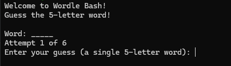
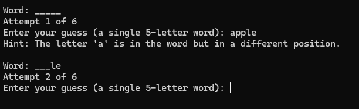
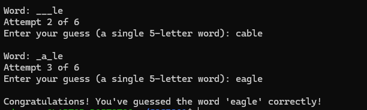
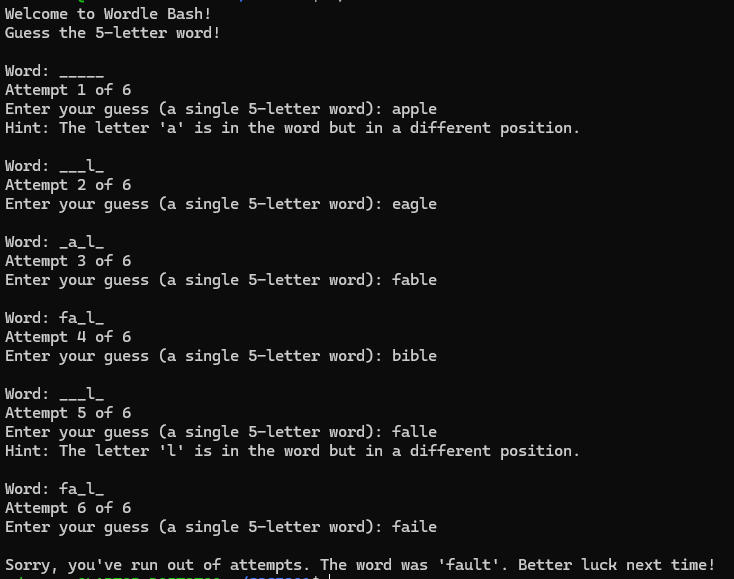

[Back to Portfolio](./)

Wordle Bash
===============

-   **Class: CSCI301 - Survey of Scripting Languages** 
-   **Grade: A** 
-   **Language(s): Bash** 
-   **Source Code Repository:** [Click Here](https://github.com/zachWeav/CSCI301_Scripting_Languages/tree/main) 
    (Please [email me](mailto:ZDWeaver@csustudent.net?subject=GitHub%20Access) to request access.)

## Project description

The Wordle Bash Game is a command-line implementation of a word-guessing game written in Bash.  This project demonstrates Bash scripting techniques that are used for simple game logic, file handling, and basic user interaction.   The game selects a 5-letter word from a predefined text file (__Wordle.txt__) and challenges users to guess the word in a limited number of attempts.  With each guess, the script will provide feedback indicating correctly or incorectly guessed letters and their positions.

**Features:**
-    **Random selection of a target word from a customizable text file**
-    **Input validation**
-    **Iterative feedback to guide the user through the game**
-    **A simple game loop with limited number of attempts to increase challenge**

## How to compile and run the program

**Prerequisites:** A bash shell is required to interpret and run the program on a Linux operating system.

**Step 1:** Navigate to the project directory __Wordle_project__ 

**Step 2:** Run the following commands:
```bash
$ chmod 755 wordle.sh
$ ./wordle.sh
```

## UI Design

Running the bash script will begin the game inside the users command line interface. 

  
Fig 1. Upon game start, the user is initially prompted to guess a five-letter word.  The user's attempts are displayed throughout the game. 


  
Fig 2. After choosing a word, the user is given hints to help guide them in their next word selection.  For each attempt, any correctly guessed letters will additionally be displayed.


  
Fig 3. If at any point the user correctly guesses the word, they are given a message congratulating them on successful game completion.


  
Fig 4. If the user fails to guess the word in __six__ attempts, the game will display a final message containing the word before exiting.


[Back to Portfolio](./)
